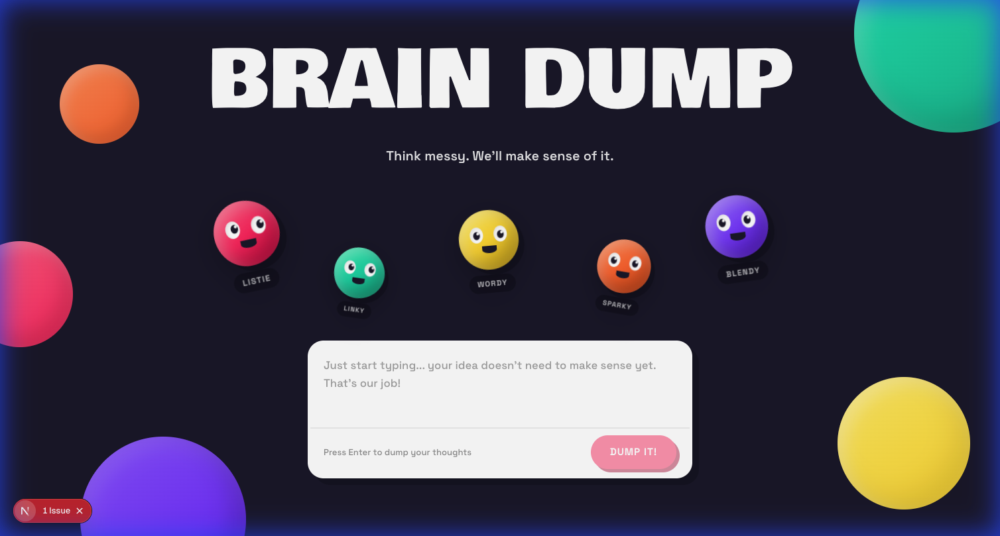
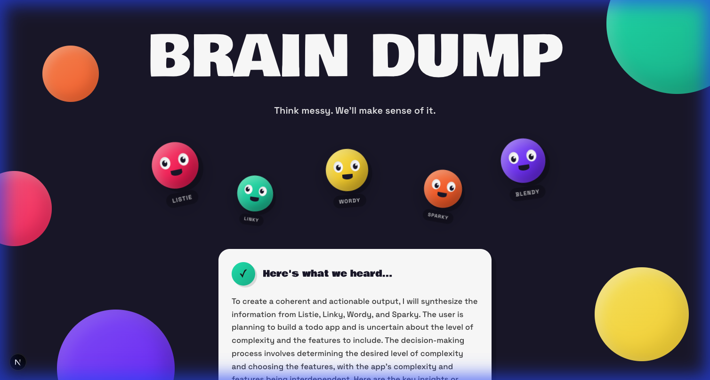

# Brain Dump


⚠️ **Status: Proof of Concept** — AI-powered thought processing tool built in 1 week to explore multi-agent orchestration for transforming messy ideas into structured insights. Not production-ready.

## Screenshots

### Landing Page


### AI-Generated Result


## Problem Statement

People often have messy, unstructured thoughts but struggle to articulate them clearly. Traditional note-taking apps don't help process or clarify ideas—they just store them.

**Brain Dump** explores whether AI agents can collaboratively transform stream-of-consciousness input into clear, actionable insights through specialized processing roles.

## Quick Start

📦 **Install:**
```bash
cd brain-dump-nextjs
npm install
```

🔑 **Configure:**
```bash
# Create .env.local
GROQ_API_KEY=your_groq_api_key_here
```

🚀 **Run:**
```bash
npm run dev
# Open http://localhost:3000
```

## What This Demonstrates

**Core Concept:** 5 specialized AI agents process user input sequentially:
1. **Listie** (Listener) - Extracts key points and themes
2. **Linky** (Connector) - Finds relationships between ideas  
3. **Wordy** (Translator) - Clarifies ambiguous language
4. **Sparky** (Challenger) - Identifies gaps and assumptions
5. **Blendy** (Synthesizer) - Creates final structured output

**Technical Skills:**
- Next.js 16 (App Router, API Routes)
- Groq SDK (llama-3.3-70b-versatile)
- Multi-agent AI orchestration
- TypeScript
- CSS animations (no libraries)
- Prompt engineering

## Current Features

✅ **Sequential AI Processing** - 5 agents process input in order  
✅ **Real-time Visual Feedback** - Animated characters show processing state  
✅ **Structured Output** - AI generates interpretation + key insights  
✅ **Quirky UI Design** - Custom CSS animations, no emoji clutter  
✅ **Error Handling** - Graceful fallbacks for API failures

## Use Cases

### Current/Validated Use Cases
- **Brainstorming sessions:** Transform scattered ideas into structured concepts (tested with personal use)
- **Meeting notes processing:** Convert messy notes into clear action items
- **Creative writing:** Break down complex story ideas into components

### Where This Doesn't Work Well
- **Real-time collaboration:** Single-user only, no multi-user support
- **Long-form content:** Optimized for short inputs (< 500 words)
- **Highly technical content:** Agents lack domain-specific knowledge

## Success Metrics

**Goal:** Demonstrate that sequential AI agents can produce higher-quality output than a single AI call.

**Current Results:**
- ✅ Processing time: ~7-8 seconds (5 sequential API calls)
- ✅ Output quality: Subjectively better structure than single-prompt approach
- ⚠️ Cost: ~5x more expensive than single AI call (trade-off for quality)

**Known Limitation:** No quantitative validation yet—quality assessment is subjective.

## Roadmap & Feature Prioritization

### MVP (Complete ✅)
- **Must Have:** 5-agent sequential processing
- **Must Have:** Visual feedback during processing
- **Must Have:** Structured JSON output from agents
- **Should Have:** Error handling and fallbacks

### Phase 2 (Future Work - Not Started)
- **Should Have:** LangGraph integration for true agentic orchestration
  - Agents make autonomous routing decisions
  - Dynamic agent selection based on input
  - Tool use (web search, analysis)
  - Parallel agent execution
- **Could Have:** Save/export results
- **Could Have:** User accounts and history

### Intentionally Out of Scope
- **Won't Have:** Mobile app (web-first focus)
- **Won't Have:** Real-time collaboration (single-user POC)
- **Won't Have:** Production deployment (demo/portfolio only)

## Architecture

```
User Input
    ↓
Frontend (Next.js)
    ↓
POST /api/process
    ↓
Sequential Processing:
Listie → Linky → Wordy → Sparky → Blendy
    ↓
AI-Generated Output
    ↓
Display Result Card
```

**Key Design Decision:** Sequential processing (not parallel) to ensure each agent builds on previous insights. Trade-off: slower but more coherent output.

## Tech Stack

- **Frontend:** Next.js 16, TypeScript, CSS (no UI libraries)
- **AI:** Groq SDK (llama-3.3-70b-versatile)
- **Deployment:** Local development only
- **State Management:** React hooks (no external state library)

## Known Issues

See [KNOWN_ISSUES.md](./KNOWN_ISSUES.md) for full list.

**Critical Limitations:**
- ⚠️ **Not truly agentic:** Agents run in fixed sequence, no autonomous decision-making
- ⚠️ **No tool use:** Agents can't search web or access external data
- ⚠️ **Expensive:** 5 API calls per request (~$0.01-0.02 per use)
- ⚠️ **Slow:** 7-8 seconds processing time

## What I Learned

**Successes:**
- Sequential agent processing does produce more structured output
- Visual feedback (animated characters) makes AI processing feel less like a black box
- Groq's llama-3.3-70b is fast enough for real-time UX

**Surprises:**
- Prompt engineering is harder than expected—agents often ignore JSON format instructions
- CSS animations are sufficient for this use case; didn't need React Three Fiber
- Users care more about output quality than processing speed

**Next Time:**
- Start with LangGraph from the beginning for true agentic behavior
- Add streaming responses for better UX
- Implement caching to reduce redundant API calls

## Demo

See [DEMO.md](./DEMO.md) for detailed walkthrough.

**Quick Demo:**
1. Type: "I want to build a todo app but I'm not sure about features"
2. Watch agents process (Listie → Linky → Wordy → Sparky → Blendy)
3. Get structured output with interpretation and key insights

## License

MIT License - See [LICENSE](./LICENSE)

## Author

Built by Demarcus Crump as an AI portfolio project exploring multi-agent orchestration.

**Connect:**
- GitHub: [Your GitHub]
- LinkedIn: [Your LinkedIn]
- Portfolio: [Your Portfolio]

---

**Note:** This is a proof-of-concept built for learning and demonstration. It's not production-ready and hasn't been validated with real users beyond personal testing.
